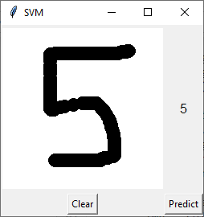
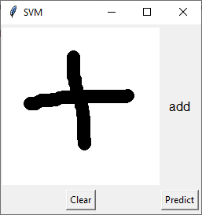
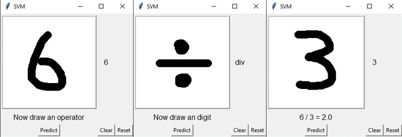

# Handwritten Digit Recognition

Developing a Machine Learning Modal to recognize Hand written Digit using Convonutional Neural Network(CNN) and Support Vector Machine(SVM). Initially we tried with CNN, it didn't work as expected, so we switched to SVM.

### Implementation
1. **Prediction of Digits**  

1. **Prediction of Operators**  

1. **Combining both predictions to calculate simple Math Operations**  

### Setup
- We simply followed this [Setup Instructions](https://github.com/jeffheaton/t81_558_deep_learning/blob/master/install/tensorflow-install-jul-2020.ipynb) for setting up the development environment

### References Links
- [Comprehensive guide to CNN](https://towardsdatascience.com/a-comprehensive-guide-to-convolutional-neural-networks-the-eli5-way-3bd2b1164a53)
- [Introduction to CNN](https://towardsdatascience.com/convolutional-neural-network-17fb77e76c05#:~:text=Fully%20Connected%20Layer%20is%20simply,into%20the%20fully%20connected%20layer.)
- [CNN - Beginner Guide](https://towardsdatascience.com/convolution-neural-networks-a-beginners-guide-implementing-a-mnist-hand-written-digit-8aa60330d022)
- [Visualization Video 1](https://youtu.be/f0t-OCG79-U)

### Similar Projects Links

- [Link1](http://www.diva-portal.org/smash/get/diva2:1293077/FULLTEXT02.pdf)
- [Link2](https://iarjset.com/upload/2017/si/NCAIT%2017/IARJSET-NCAIT%2011.pdf)
- [Link3](https://www.researchgate.net/profile/Rishika-Kushwah-2/publication/343010636_Handwritten_Digit_Recognition_using_Machine_and_Deep_Learning_Algorithms/links/5f146d91299bf1e548c36fba/Handwritten-Digit-Recognition-using-Machine-and-Deep-Learning-Algorithms.pdf?origin=publication_detail)
